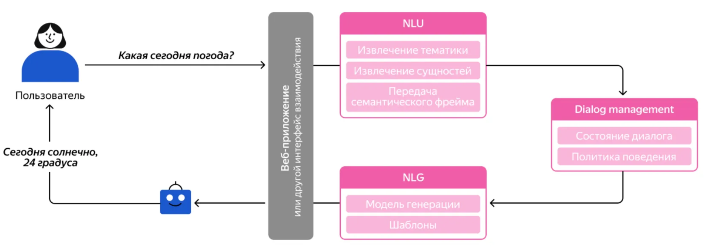
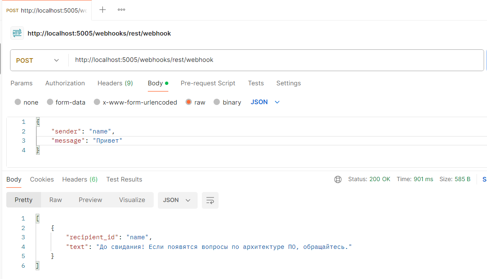
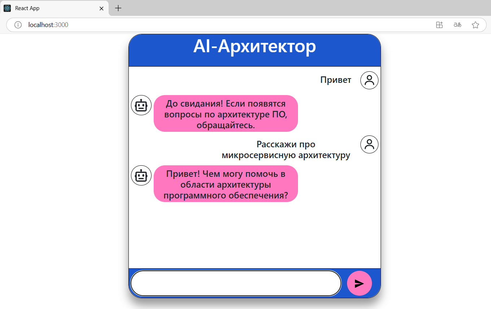

## Диалоговая система на основе AI и миграция сервисов в облако 

### Архитектура 
Диалоговая система на основе AI cостоит из: 
- frontend react приложения;    
- backend приложение с обученной llm моделью на основе среды машинного обучения Rasa;

    

Архитектура backed приложения состоит из модулей:   
- Natural Language Understanding (NLU) - отвечает за анализ и интерпретацию входящего текста;   
- Dialog Management (DM) - отслеживает текущее состояние диалога, сохраняет контекст, управляет диалогом;
- Natural Language Generation (NLG) - формирует текстовый ответ;

### Как запустить проект    
- установить python версий 3.7-3.10;    
- создать виртуальное окружение python python -m venv rasa_env и активировать его activate;   
- установить среду rasa pip install rasa, pip install transformers;   
- установить сценарии в конфиг-файлах config.yml, stories.yml, rules.yml, nlu.yml, domain.yml;    
- проинициализировать проект rasa init;   
- обучить модель rasa train;  
- запустить rasa run --enable-api --cors "*" --debug; 
- запустить react приложение npm run start;   

#### Frontend доступен на localhost:3000;    
#### Backend доступен на localhost:5005/webhooks/rest/webhook;          
       
    
#### Режим диалога   
     

Логи находятся в файле rasa_project/rasa_log       

### Миграция сервисов в облако      
Для миграции сервисов в облако можно использовать одну из 6 стратегий:  
- Retain - в рамках этого подхода выделяются отдельные компоненты решения, которые остаются в текущем on-premise окружении;     
- Retire - все решение или его компоненты выводятся из эксплуатации;  
- Rehost - решение переносится в облачную среду без изменений "как есть";    
- Repurchase - решение полностью заменяется на облачный сервис (sas);  
- Replatform - используются сервисы облачной платформы;      
- Refactor - архитектура перерабатывается под облачную среду; 

Для управления и настройки облачной инфраструктуры используются такие инструменты, как Ansible, Terraform или сервисы облачного провайдера;         

